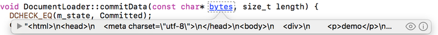

Chromium源码版本101.0.4943.1

本文只关注两者文件加载部分的源码，HTML文档的DOM树构建和CSS解析部分与样式文件加载部分的代码是相对独立的，这很大程度决定了笔者可以放心地只关注狭小的一段代码范围，而不用担心阅读太多的代码。

注：把类图搞过来。

link元素和@import规则在文件加载部分其实是共同的，调用的是Blink的[ResourceFetcher::RequestResource](https://chromium.googlesource.com/chromium/src/+/refs/tags/101.0.4943.1/third_party/blink/renderer/platform/loader/fetch/resource_fetcher.cc#964)，源码如下：

```

Resource* ResourceFetcher::RequestResource(FetchParameters& params,
                                           const ResourceFactory& factory,
                                           ResourceClient* client) {
  base::AutoReset<bool> r(&is_in_request_resource_, true);
  // If detached, we do very early return here to skip all processing below.
  if (properties_->IsDetached()) {
    return ResourceForBlockedRequest(
        params, factory, ResourceRequestBlockedReason::kOther, client);
  }
  // 观察者模式，看看是不是这次资源的网络请求
  if (resource_load_observer_) {
    resource_load_observer_->DidStartRequest(params, factory.GetType());
  }
  
  // 同源策略
  DCHECK(properties_->GetFetchClientSettingsObject().GetSecurityOrigin());
  // 网络请求的标识符
  uint64_t identifier = CreateUniqueIdentifier();
  ResourceRequest& resource_request = params.MutableResourceRequest();
  resource_request.SetInspectorId(identifier);
  resource_request.SetFromOriginDirtyStyleSheet(
      params.IsFromOriginDirtyStyleSheet());
  TRACE_EVENT_NESTABLE_ASYNC_BEGIN1(
      TRACE_DISABLED_BY_DEFAULT("network"), "ResourceLoad",
      TRACE_ID_WITH_SCOPE("BlinkResourceID", TRACE_ID_LOCAL(identifier)), "url",
      resource_request.Url());
  SCOPED_BLINK_UMA_HISTOGRAM_TIMER_THREAD_SAFE(
      "Blink.Fetch.RequestResourceTime");
  TRACE_EVENT1("blink,blink.resource", "ResourceFetcher::requestResource",
               "url", params.Url().ElidedString().Utf8());
  
  // 发起网络请求的源地址
  if (!resource_request.RequestorOrigin()) {
    resource_request.SetRequestorOrigin(
        properties_->GetFetchClientSettingsObject().GetSecurityOrigin());
  }
  const ResourceType resource_type = factory.GetType();
  WebScopedVirtualTimePauser pauser;
  // 本次网络请求是否会阻塞
  absl::optional<ResourceRequestBlockedReason> blocked_reason =
      PrepareRequest(params, factory, pauser);
  if (blocked_reason) {
    return ResourceForBlockedRequest(params, factory, blocked_reason.value(),
                                     client);
  }
  // 准备发起网络请求，各种有效性验证
  Resource* resource = nullptr;
  RevalidationPolicy policy = RevalidationPolicy::kLoad;
  bool is_data_url = resource_request.Url().ProtocolIsData();
  bool is_static_data = is_data_url || archive_;
  bool is_stale_revalidation = params.IsStaleRevalidation();
  if (!is_stale_revalidation && is_static_data) {
    // 发起网络请求
    resource = CreateResourceForStaticData(params, factory);
    if (resource) {
      policy =
          DetermineRevalidationPolicy(resource_type, params, *resource, true);
    } else if (!is_data_url && archive_) {
      // Abort the request if the archive doesn't contain the resource, except
      // in the case of data URLs which might have resources such as fonts that
      // need to be decoded only on demand. These data URLs are allowed to be
      // processed using the normal ResourceFetcher machinery.
      return ResourceForBlockedRequest(
          params, factory, ResourceRequestBlockedReason::kOther, client);
    }
  }
  // 资源是否获取成功
  bool same_top_frame_site_resource_cached = false;
  bool in_cached_resources_map = cached_resources_map_.Contains(
      MemoryCache::RemoveFragmentIdentifierIfNeeded(params.Url()));
  if (!is_stale_revalidation && !resource) {
    // 再次发起网络请求
    resource = MatchPreload(params, resource_type);
    if (resource) {
      policy = RevalidationPolicy::kUse;
      MakePreloadedResourceBlockOnloadIfNeeded(resource, params);
    } else if (IsMainThread()) {
      if (base::FeatureList::IsEnabled(features::kScopeMemoryCachePerContext) &&
          !in_cached_resources_map) {
        resource = nullptr;
      } else {
        resource = GetMemoryCache()->ResourceForURL(
            params.Url(), GetCacheIdentifier(params.Url()));
      }
      if (resource) {
        policy = DetermineRevalidationPolicy(resource_type, params, *resource,
                                             is_static_data);
        scoped_refptr<const SecurityOrigin> top_frame_origin =
            resource_request.TopFrameOrigin();
        if (top_frame_origin) {
          same_top_frame_site_resource_cached =
              resource->AppendTopFrameSiteForMetrics(*top_frame_origin);
        }
      }
    }
  }
  UpdateMemoryCacheStats(resource, policy, params, factory, is_static_data,
                         same_top_frame_site_resource_cached);
  // 重试不一定成功，看看资源状态
  switch (policy) {
    case RevalidationPolicy::kReload:
      GetMemoryCache()->Remove(resource);
      [[fallthrough]];
    case RevalidationPolicy::kLoad:
      resource = CreateResourceForLoading(params, factory);
      break;
    case RevalidationPolicy::kRevalidate:
      InitializeRevalidation(resource_request, resource);
      break;
    case RevalidationPolicy::kUse:
      if (resource_request.AllowsStaleResponse() &&
          resource->ShouldRevalidateStaleResponse()) {
        ScheduleStaleRevalidate(resource);
      }
      break;
  }
  // 从这开始，检查资源是否获取正确
  DCHECK(resource);
  DCHECK_EQ(resource->GetType(), resource_type);
  if (policy != RevalidationPolicy::kUse)
    resource->VirtualTimePauser() = std::move(pauser);
  if (client)
    client->SetResource(resource, freezable_task_runner_.get());
  
  if (!params.IsSpeculativePreload() || policy != RevalidationPolicy::kUse) {
    if (resource_request.Priority() > resource->GetResourceRequest().Priority())
      resource->DidChangePriority(resource_request.Priority(), 0);
  }
  
  DCHECK(EqualIgnoringFragmentIdentifier(resource->Url(), params.Url()));
  if (policy == RevalidationPolicy::kUse &&
      resource->GetStatus() == ResourceStatus::kCached &&
      !in_cached_resources_map) {
    // Loaded from MemoryCache.
    DidLoadResourceFromMemoryCache(resource, resource_request, is_static_data,
                                   params.GetRenderBlockingBehavior());
  }
  if (!is_stale_revalidation) {
    String resource_url =
        MemoryCache::RemoveFragmentIdentifierIfNeeded(params.Url());
    cached_resources_map_.Set(resource_url, resource);
    if (PriorityObserverMapCreated() &&
        PriorityObservers()->Contains(resource_url)) {
      // Resolve the promise.
      std::move(PriorityObservers()->Take(resource_url))
          .Run(static_cast<int>(
              resource->GetResourceRequest().InitialPriority()));
    }
  }
  
  // 加载的静态资源是图片
  ImageLoadBlockingPolicy load_blocking_policy =
      ImageLoadBlockingPolicy::kDefault;
  if (resource->GetType() == ResourceType::kImage) {
    image_resources_.insert(resource);
    not_loaded_image_resources_.insert(resource);
    if (params.GetImageRequestBehavior() ==
        FetchParameters::kNonBlockingImage) {
      load_blocking_policy = ImageLoadBlockingPolicy::kForceNonBlockingLoad;
    }
  }
  // 从这开始做最后一次验证
  if (ResourceNeedsLoad(resource, params, policy)) {
    if (!StartLoad(resource,
                   std::move(params.MutableResourceRequest().MutableBody()),
                   load_blocking_policy, params.GetRenderBlockingBehavior())) {
      resource->FinishAsError(ResourceError::CancelledError(params.Url()),
                              freezable_task_runner_.get());
    }
  }
  if (policy != RevalidationPolicy::kUse)
    InsertAsPreloadIfNecessary(resource, params, resource_type);
  if (resource->InspectorId() != identifier ||
      (!resource->StillNeedsLoad() && !resource->IsLoading())) {
    TRACE_EVENT_NESTABLE_ASYNC_END1(
        TRACE_DISABLED_BY_DEFAULT("network"), "ResourceLoad",
        TRACE_ID_WITH_SCOPE("BlinkResourceID", TRACE_ID_LOCAL(identifier)),
        "outcome", "Fail");
  }
  return resource;
}
```

@import规则与link元素在网络加载方面做的工作总结来说就是发起网络请求、验证资源有效性。二者基本只在处理时机有些不同，link在时间上稍微靠前，处理元素的attribute时候遇到href就开始准备发起网络请求，这时还是在DOM树的构建阶段，文件加载的入口是[HTMLLinkElement::LoadStyleSheet](https://chromium.googlesource.com/chromium/src/+/refs/tags/101.0.4943.1/third_party/blink/renderer/core/html/html_link_element.cc#208)。@import是在CSS语法分析的过程中处理，样式表的语法分析入口是[CSSParserImpl::ParseStyleSheet](https://chromium.googlesource.com/chromium/src/+/refs/tags/101.0.4943.1/third_party/blink/renderer/core/css/parser/css_parser_impl.cc#278)。这两个函数不是本文要讨论的内容，就不分析了。

**在看看href属性的处理机制之前，我们先看看DOM树是如何构建的。**

##### 加载机制

DocumentLoader类里面的StartLoadingInternal函数加载url指向的数据

~~里去加载url返回的数据，如访问一个网站则返回html文本：~~

~~把参数里的m_request打印出来，在这个函数里面加一行代码：~~

发请求后，每次收到的数据块，会通过Blink封装的IPC进程间通信，触发DocumentLoader的BodyDataReceived函数，里面会去调它CommitData函数，开始处理具体业务逻辑：

```
void DocumentLoader::CommitData(const char* bytes, size_t length) {
  TRACE_EVENT1("loading", "DocumentLoader::CommitData", "length", length);  
  
  if (!frame_ || !frame_->GetDocument()->Parsing())
    return;  

  base::AutoReset<bool> reentrancy_protector(&in_commit_data_, true);
  if (length)
    data_received_ = true;
  parser_->AppendBytes(bytes, length);
}
```

初始化上面画的UML图的解析器HTMLDocumentParser (Parser)，并实例化document对象，~~这些对象都是通过实例m_writer去带动的~~。

~~也就是说，writer会去~~实例化Parser~~之后，第7行writer传递数据给Parser去解析。~~

StartLoadingResponse函数里去加载url返回的数据，如访问一个网站则返回html文本：

~~把参数里的m_request打印出来，在这个函数里面加一行代码：~~

检查一下收到的数据bytes是什么东西：



可以看到bytes就是请求返回的html文本。

在上面的AppendBytes函数里面，会启动一条线程执行Parser的任务：

并把数据传递给这条线程进行解析，Parser一旦收到数据就会序列成tokens，再构建DOM树。

### 构建DOM树

#### （1）DOM结点

在研究这个过程之前，先来看一下一个DOM结点的数据结构是怎么样的。按照惯例，先给出UML图

每个Node都组合了一个treeScope，这个treeScope记录了它属于哪个document（一个页面可能会嵌入iframe）。

构建DOM最关键的步骤应该是建立起每个结点的父子兄弟关系，即上面提到的成员指针的指向。

#### （2）处理开始步骤

Webkit把tokens序列好之后，传递给构建的线程。在HTMLDocumentParser::processTokenizedChunkFromBackgroundParser的这个函数里面会做一个循环，把解析好的tokens做一个遍历，依次调constructTreeFromCompactHTMLToken进行处理。

根据上面的输出，最开始处理的第一个token是docType的那个：

在那个函数里面，首先Parser会调TreeBuilder的函数：
